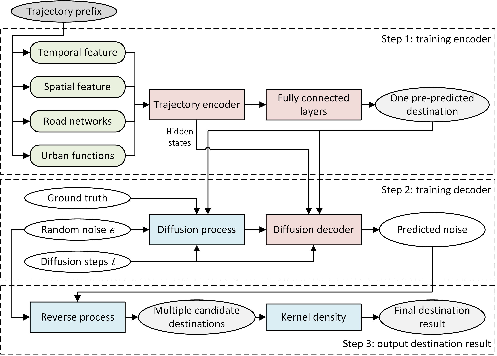
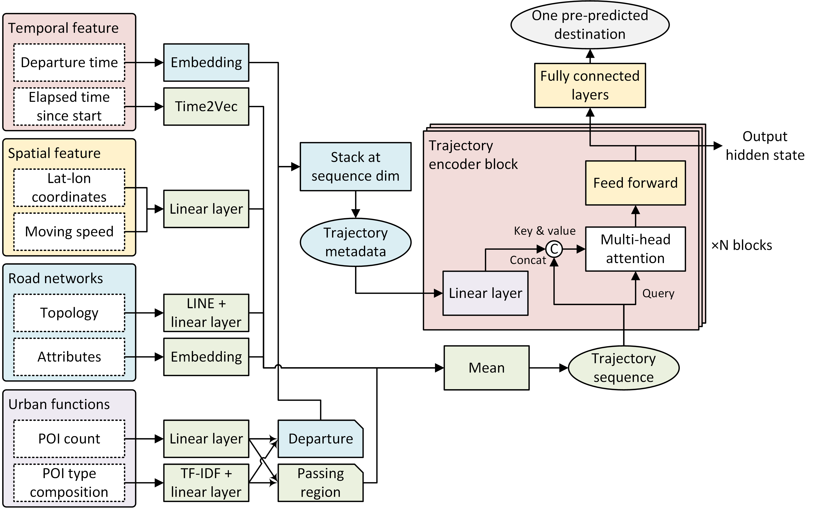
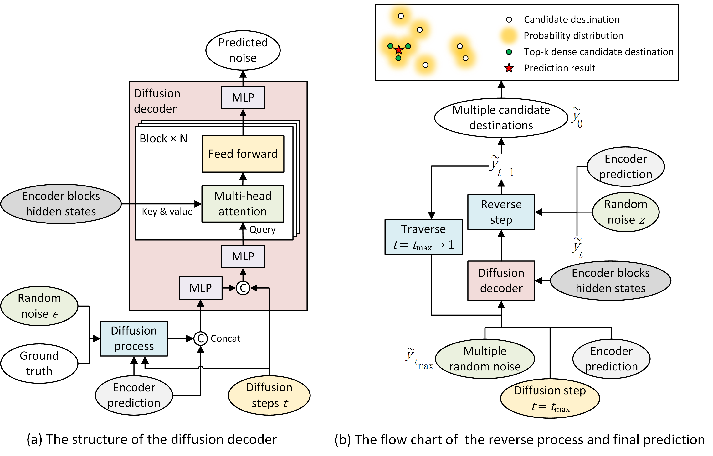

# Predicting trajectory destinations based on diffusion model integrating spatiotemporal features and urban contexts

The code for the research article "Predicting trajectory destinations based on diffusion model integrating spatiotemporal features and urban contexts".

The code for the article [**Hu et al. (2024)**](http://dx.doi.org/10.1080/17538947.2024.2421955) entitled "Predicting trajectory destinations based on diffusion model integrating spatiotemporal features and urban contexts" published on *International Journal of Digital Earth*.

The preprocessed data for this article can be obtained from [**Figshare**](https://doi.org/10.6084/m9.figshare.25663308).

## Research framework

The overall framework of our model consists of an encoder-decoder structure with a two-step training process:

| module | the problem to address | key information | 
| ---- | ---- | ----|
| Trajectory encoder | data sparsity problem | integrating spatiotemporal features and urban contexts, Transformer-based |
| Diffusion decoder | modifiable areal unit problem (MAUP) | diffusion process for training, reverse process for inference |



1. Considered features

<table>
	<tr>
		<th>level 1 features</th><th>level 2 features</th><th>details</th>
	</tr>
	<tr>
		<td rowspan=2>spatiotemporal features</td><td>temporal features</td><td>departure hour, weekday, is_vacation; elapsed time since start</td>
	</tr>
  <tr>
		<td>spatial features</td><td>latitude, longitude, and moving speed</td>
	</tr>
	<tr>
		<td rowspan=2>urban contexts</td><td>road networks</td><td>topological and attributive information of roads</td>
	</tr>
  <tr>
		<td>urban functions</td><td>departure and passing by regions, using POI data</td>
	</tr>
</table>

2. Trajectory encoder

  

3. Diffusion decoder

  

## Requirements

Experiments were done with the following packages for Python 3.9:

```
dgl==1.0.1
geopandas==0.10.1
networkx==2.6.3
numpy==1.23.5
pandas==1.5.3
pytorch==1.12.1
scikit-learn==1.2.2
scipy==1.10.1
tslearn==0.5.2
```

## File descriptions

* `embedding_road.py`: Train the embedding vectors of road segments.

* `globalval.py`: Some global variables of this repository.

* `predict_dataset.py`: Dataset structure of the training model.

* `predict_nn.py`: Neural network structure of the prediction model.

* `predict_remote.py`: Train the model in remote server.

* `predict_trainval.py`: The process of training, validating and testing model.

* `preprocess_sz.py`: Preprocess the original data for this study. The data after preprocessing can be obtained from [**Figshare**](https://doi.org/10.6084/m9.figshare.25663308).

* `scratch.py`: Scratch file for data visualization and charting.

## Citation

* Plain Text

    Hu, J., Gao, Y., & Huang, Z. (2024). Predicting trajectory destinations based on diffusion model integrating spatiotemporal features and urban contexts. *International Journal of Digital Earth*, *17*(1), 2421955. doi: 10.1080/17538947.2024.2421955

* BibTex

    ```
    @article{doi:10.1080/17538947.2024.2421955,
    author = {Junjie Hu, Yong Gao and Zhou Huang},
    title = {Predicting trajectory destinations based on diffusion model integrating spatiotemporal features and urban contexts},
    journal = {International Journal of Digital Earth},
    volume = {17},
    number = {1},
    pages = {2421955},
    year  = {2024},
    publisher = {Taylor & Francis},
    doi = {10.1080/17538947.2024.2421955}
    }
    ```
